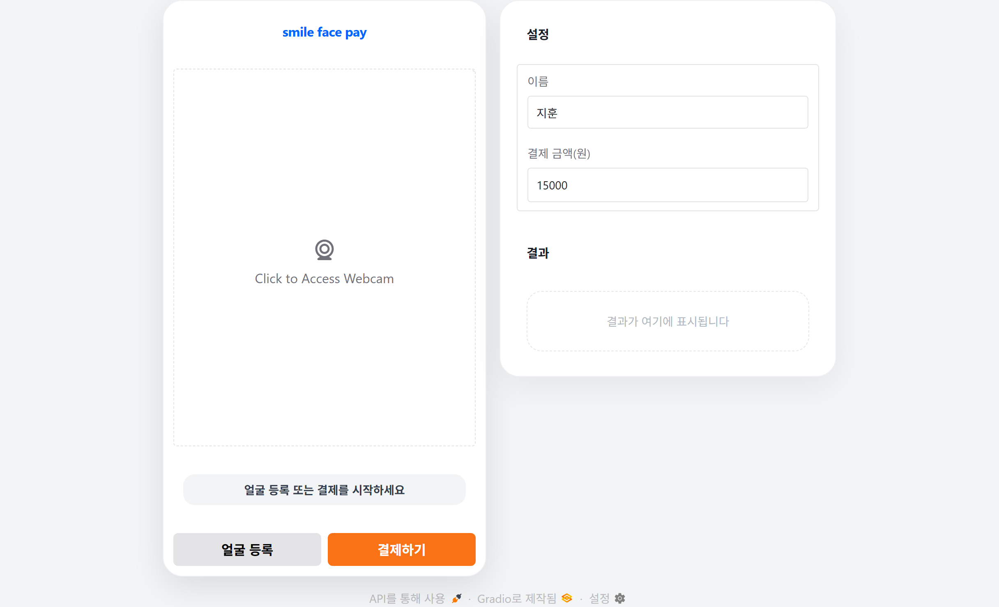
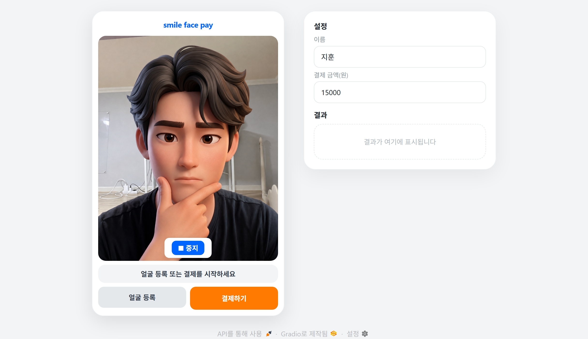
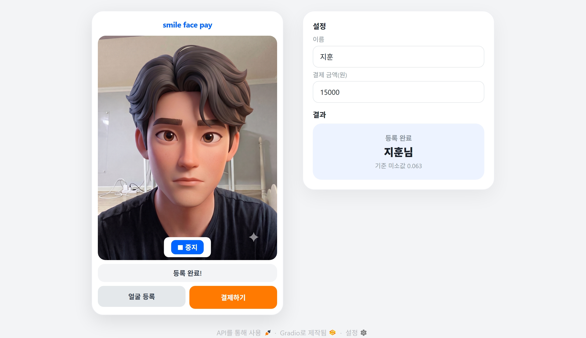
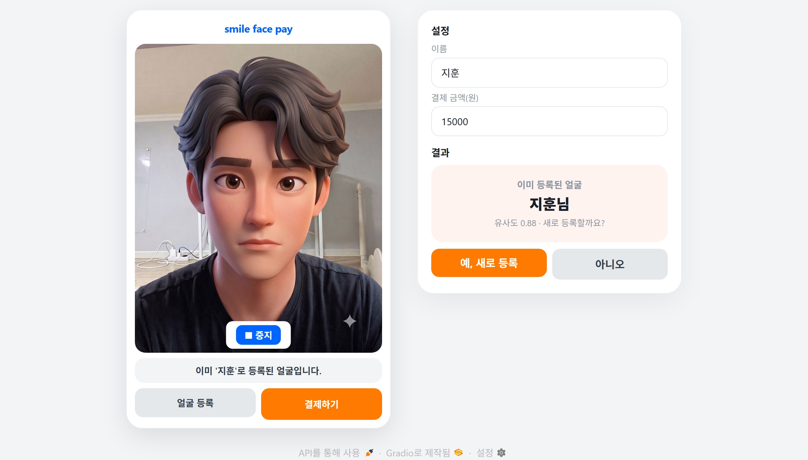
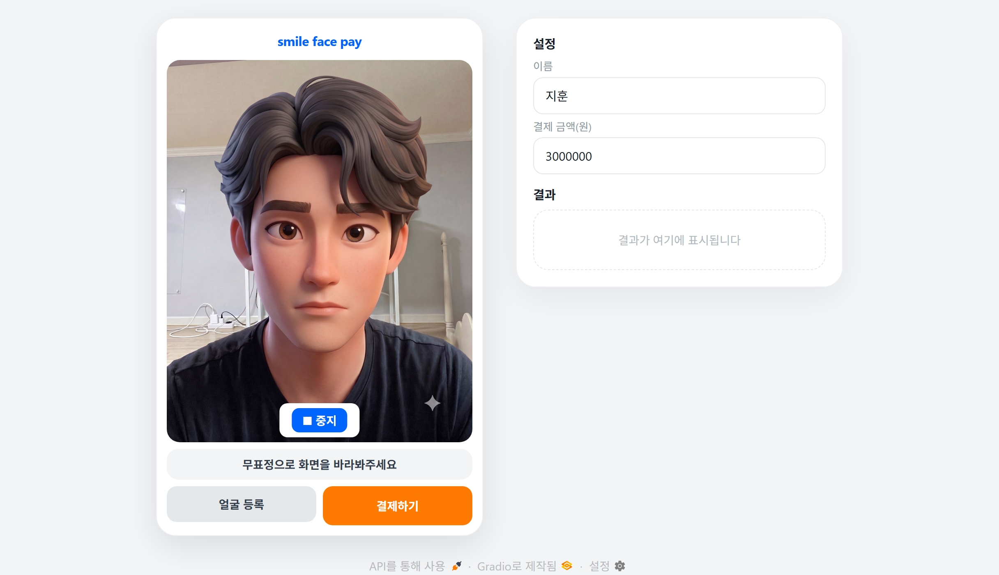
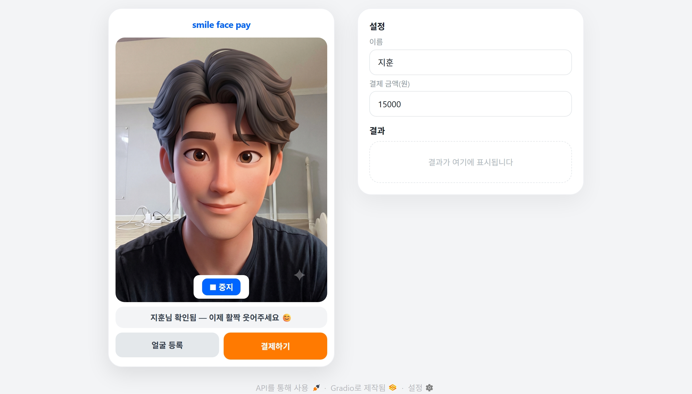
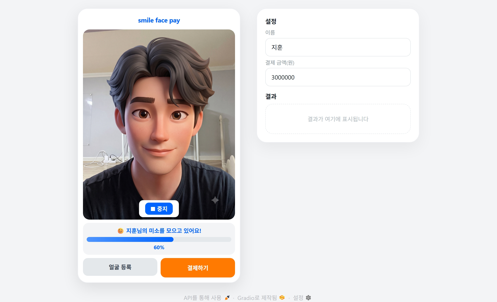
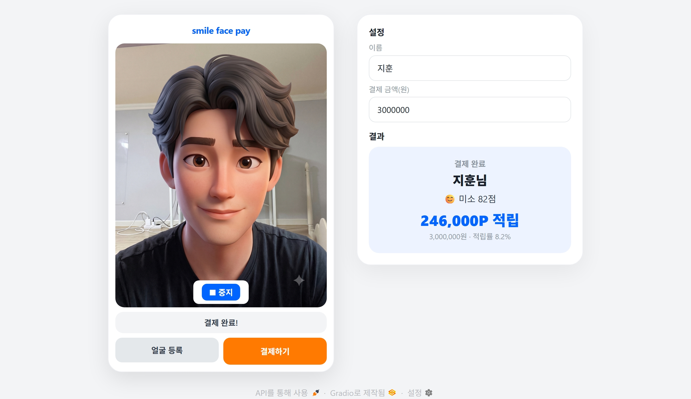
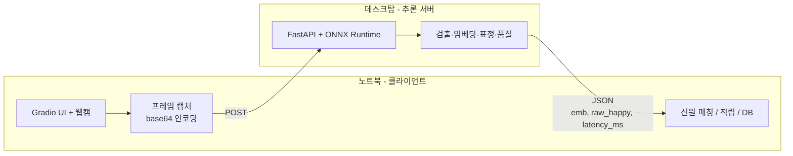

# Smile Face Pay

얼굴로 본인을 인증하고, 인증 순간의 미소 점수(0~100점)에 비례해 포인트를 적립하는 얼굴 인증 결제 데모입니다. Vision AI 서빙 파이프라인을 CPU/GPU 환경에서 설계·측정하는 것을 목표로 한 포트폴리오 프로젝트입니다.

> 적립률 = 미소 점수 × 0.1 (최대 10%). 결제 금액에 이 적립률을 곱해 포인트를 적립합니다.


<!-- 이미지 자리: 앱 전체 화면 스크린샷. 좌측 단말기(웹캠+상태바+버튼), 우측 설정/결과 카드가 한 화면에 보이는 메인 UI -->

---

## 1. 프로젝트 개요

핀테크 결제 맥락에서 얼굴 인증에 **리워드 기능**을 결합한 데모입니다.

**제품 의도 — 진입장벽 완화.** 페이스 페이는 카메라 앞에서 얼굴을 인증한다는 행위 자체가 처음 쓰는 사용자에게 어색하고 낯설게 느껴집니다. 이 어색함이 신규 사용자의 진입장벽으로 작용합니다. "웃으면 포인트가 적립된다"는 요소는 그 어색한 순간에 명확한 행동 유인과 작은 보상을 주어, 사용자가 부담 없이 첫 사용을 시도하고 나아가 적극적으로 재사용하도록 유도합니다. 인증 경험을 방어적 절차가 아니라 가벼운 상호작용으로 바꿔, 더 많은 사용자가 페이스 페이에 정착하도록 만드는 것이 목표입니다.


세 개의 사전학습 모델을 추론 전용으로 조합하며, 별도 학습은 없습니다.

---

## 2. 데모

**대기화면**



**등록 플로우:** 얼굴 등록 → 무표정 캡처 → 임베딩 + 무표정 baseline 저장. 이미 등록된 얼굴이면 덮어쓰기 확인.

<!-- 이미지 자리: 등록 플로우 — "무표정을 지어주세요" 상태의 화면 -->



**결제 플로우:** 결제하기 → 무표정으로 신원 확인(1:N 매칭) → "웃어주세요" → N프레임 미소 수집 → 최고 미소로 적립 확정 → 결과 카드.

<!-- 이미지 자리: 결제 플로우 — "○○님 확인됨, 이제 활짝 웃어주세요" 상태에서 미소 진행률 바가 차오르는 화면 -->




<!-- 이미지 자리: 결제 완료 결과 카드 — "○○님 / 미소 N점 / N,NNNP 적립"이 표시된 화면 -->



---

## 3. 아키텍처

### 3-1. 모델 구성 (3-컴포넌트)

검출과 인식은 InsightFace가 묶어 제공하므로 실제 로드는 2개 엔진입니다.

| 역할 | 모델 | 출력 |
|------|------|------|
| 얼굴 검출 + 정렬 | InsightFace `buffalo_l` (RetinaFace 계열) | 5-point landmark로 정면 정렬 |
| 얼굴 인식 | InsightFace `buffalo_l` (ArcFace 계열) | 512-d 정규화 임베딩 → 코사인 유사도 1:N 매칭 |
| 표정(smile) | HSEmotion `enet_b0_8_best_afew` (경량 ONNX) | 8-emotion 중 happy 확률을 smile score로 사용 |

### 3-2. 서버 / 클라이언트 분리

추론(GPU)과 입력(웹캠)을 물리적으로 분리한 구조입니다.



<!-- 이미지 자리: 위 구조를 그린 아키텍처 다이어그램 (직접 그린 것이 있다면 교체) -->

- **하드웨어 역할 분리:** 서버는 순수 추론(GPU 연산)만 담당하고, 신원 매칭·적립·DB는 클라이언트가 담당합니다. 웹캠이 있는 곳(노트북)과 연산 자원이 있는 곳(데스크탑)이 다르다는 실제 제약이 그대로 클라이언트-서버 경계가 됩니다.
- **지연 분해 측정 가능:** 서버 응답에 `latency_ms`(순수 추론 시간)를 포함시켜, 클라이언트가 재는 왕복 시간과 분리해 "네트워크+직렬화 오버헤드 vs 추론 시간"을 나눠 측정합니다.
- **EP 스위치:** 서버는 환경변수 `EP`로 `cpu` / `cuda` / `trt` 실행 제공자를 코드 수정 없이 전환합니다. 벤치마크 비교축이 여기서 만들어집니다.

---

## 4. 핵심 설계 결정

### 4-1. 인식과 표정 모듈 분리

인식(신원 불변 특징)과 표정(신원 무관 변화)은 최적화 방향이 상충하므로 별도 엔진으로 분리했습니다. 검출 결과(crop)만 공유하면 중복 비용은 검출 1회로 억제됩니다.

### 4-2. 사용자별 baseline 정규화

사람마다 무표정 시 happy 확률이 다릅니다(대략 0.1~0.35). 등록 시 무표정 happy를 **baseline**으로 저장하고, 인증 시 상대값으로 정규화합니다.

```
adjusted = max(0, raw_happy - baseline) / (1 - baseline)
score    = clip(adjusted, 0, 1) * 100
```

무표정이면 0점, baseline 대비 얼마나 더 웃었는지를 0~100으로 환산합니다. 이 정규화로 사용자별 표정 편차를 보정합니다.

### 4-3. 등록/결제 차등 품질 게이트

저품질 임베딩이 등록되면 이후 모든 인증에 악영향을 주므로, **등록은 엄격하게, 결제 신원확인은 완화**하는 차등 게이트를 두었습니다.

| 체크 | 등록(strict) | 결제(완화) |
|------|-------------|-----------|
| 검출 신뢰도 | ≥ 0.60 | ≥ 0.50 |
| bbox 경계 잘림 | 차단 | 차단 |
| landmark 경계 잘림 | 차단 | 차단 |
| 얼굴 크기 | ≥ 8% | ≥ 5% |
| 정면 대칭 | ≥ 0.55 | ≥ 0.42 |

- **화면-검사 영역 일치:** UI가 CSS로 웹캠 화면을 4:5로 crop해 표시하는데, 초기에는 서버가 crop 이전 원본 전체를 받아 "화면에선 얼굴이 잘려 보이는데 통과되는" 불일치가 있었습니다. 클라이언트에서 화면 표시와 동일하게 center-crop한 뒤 전송하도록 수정해, 검사 대상과 사용자가 보는 화면을 일치시켰습니다.

### 4-4. 프레임 수 기준 미소 측정 + 진행률 UX

- **시간이 아니라 처리 프레임 수 기준으로 측정.** 추론 속도에 따라 프레임 처리 간격이 달라지므로, 시간 기준이면 느린 환경에서 측정 구간을 건너뛰는 문제가 있었습니다. `SMILE_FRAMES`장을 모을 때까지 수집하는 방식으로 환경 독립적으로 만들었습니다.
- **깜빡임 방지:** 웹캠 stream은 세션 상태만 갱신하고, 화면 HTML은 별도 Timer가 "값이 바뀔 때만" 다시 그리도록 분리했습니다.
- **진행률 바:** 미소 점수와 분리된 "처리 프레임 진행률"을 목표값까지 부드럽게 이징해 채웁니다.

---

## 5. 서빙 & 벤치마크

### 5-1. 측정 방법론

고정 테스트 이미지로 두 지표를 측정합니다.

- **Latency:** 단발 요청을 순차 반복해 round-trip과 server-only 시간의 p50/p95/p99를 산출. 워밍업 요청은 측정에서 제외.
- **Throughput:** 동시 요청 수(concurrency)를 1→16으로 올려가며 QPS와 평균 지연을 측정.

### 5-2. CPU 서빙 결과

AMD Ryzen 7 9700X, CPU 추론, `n=100`, localhost 측정.

**Latency**

| 구간 | p50 | p95 | p99 | mean |
|------|-----|-----|-----|------|
| round-trip | 235.7ms | 299.5ms | 311.3ms | 230.9ms |
| server-only | 219.1ms | 284.8ms | — | 216.2ms |

→ 네트워크 + 직렬화 오버헤드(평균): **14.7ms**

**Throughput**

| concurrency | QPS | avg_ms |
|:-----------:|:---:|:------:|
| 1 | 4.4 | 235.8 |
| 2 | 5.8 | 356.8 |
| 4 | 8.4 | 491.8 |
| 8 | 12.0 | 700.6 |
| 16 | 16.0 | 1092.0 |

**관찰:** 동시성을 올릴수록 QPS는 완만하게만 증가(4.4→16.0)하고 평균 지연은 급증(236→1092ms)합니다. CPU가 동시 요청을 병렬 처리하지 못하고 사실상 큐잉으로 처리하기 때문으로, "CPU 서빙은 동시성 증가 시 처리량이 포화되고 지연이 선형 악화된다"는 전형적 패턴을 보여줍니다.

### 5-3. GPU 전환 시도와 폴백 진단

RTX 5090(Blackwell, sm_120)으로 GPU 가속을 시도하는 과정에서, **조용한 CPU 폴백**을 발견하고 원인을 규명했습니다. 이 과정을 기록으로 남깁니다.

**증상:** `EP=cuda`, `EP=trt`로 전환해도 latency가 CPU 대비 1.4배 수준에 그치고, throughput은 거의 동일했습니다. GPU 가속이라기엔 개선폭이 비정상적으로 작았습니다.

**진단 절차:**
1. 벤치마크 중 `nvidia-smi`로 GPU 사용률 확인 → **GPU-Util이 오르지 않음** (연산이 GPU에서 일어나지 않음).
2. 실제 세션 provider 확인:
   ```python
   sess = ort.InferenceSession(model, providers=['CUDAExecutionProvider','CPUExecutionProvider'])
   print(sess.get_providers())   # → ['CPUExecutionProvider']  (조용한 폴백)
   ```
   `get_available_providers()`에는 CUDA가 나열되지만(빌드가 지원 가능하다는 의미일 뿐), 실제 세션은 CPU로 폴백되어 있었습니다.

**근본 원인:** 공식 PyPI `onnxruntime-gpu` 패키지에는 sm_120(Blackwell) 커널이 포함돼 있지 않습니다. 따라서 RTX 5090에서 CUDA Execution Provider가 커널을 찾지 못하고 CPU로 폴백됩니다.

**중요한 구분 — PyTorch ≠ onnxruntime:** PyTorch는 이미 sm_120을 지원(`torch 2.11.0+cu128`, capability `(12,0)`)하지만, InsightFace·HSEmotion은 **onnxruntime로 추론**하므로 PyTorch의 sm_120 지원과 무관하게 폴백이 발생합니다. 프레임워크마다 최신 아키텍처 지원 시점이 다르다는 점이 핵심입니다.

**해결 경로 (미적용):**
- CUDA Toolkit 12.8+ 설치 후 `CMAKE_CUDA_ARCHITECTURES=120`으로 onnxruntime 소스 빌드. (현재 시스템 `nvcc`가 11.5라 이 전제조건부터 미충족)
- 또는 x86_64 Linux + Python 3.10용 sm_120 커뮤니티 wheel 확보 (현재 공개된 것 없음, Windows·aarch64용만 존재)
- 또는 공식 배포판의 sm_120 커널 지원 대기

이 프로젝트에서는 "웹앱을 서빙 파이프라인으로 분리하고, 측정 방법론을 설계하며, 성능 이상을 진단하는" 목표에 집중하기 위해 GPU 커널 빌드는 향후 과제로 남겨두었습니다. **조용한 CPU 폴백은 로그상 GPU 사용을 주장하면서도 실제로는 CPU로 도는, 프로덕션에서 성능 사고를 일으키는 대표적 함정입니다.**

---

## 6. 실행 방법

### 환경

- Python 3.10 (Anaconda `smilepay`)
- 설치: `pip install -r requirements.txt`
- 모델 가중치는 첫 실행 시 자동 다운로드 (`~/.insightface/`, HSEmotion 캐시)

### 서버 (추론 담당)

```bash
# 프로젝트 루트, EP는 cpu / cuda / trt 중 택1
EP=cpu uvicorn server:app --host 0.0.0.0 --port 8000
```

`http://<서버IP>:8000/health` 로 상태 확인.

### 클라이언트 (웹캠 UI)

```bash
python app_ui.py
# 브라우저에서 http://127.0.0.1:7860
```

`app_ui.py`의 `SERVER_URL`을 추론 서버 주소로 설정합니다.

### 벤치마크

```bash
python bench/benchmark.py --url http://localhost:8000 --image bench/face.jpg
```

---

## 7. 한계 및 향후 과제

- **GPU 실측 미완:** 위 5-3의 sm_120 커널 이슈로 GPU 벤치마크는 미완. CUDA Toolkit 12.8+ 설치 후 소스 빌드로 CUDA EP / TensorRT EP를 살려 CPU 대비 성능과 EP 간 트레이드오프를 측정하는 것이 다음 단계입니다.
- **liveness 정교화:** 현재는 "미소 요구 = 간이 라이브니스" 개념 수준. smile-delta 검증이나 blink 검출을 실제 구현하고, 정지 사진 공격 성공률 저감을 정량화하는 것이 확장 방향입니다.
- **등록 임계값 분리:** 등록 중복 판정 threshold를 인증과 완전히 분리(등록을 더 엄격하게)하는 것을 검토 중입니다.
- **부하 한계 탐색:** 현재 동시성 16까지 측정. GPU 확보 후 포화점(QPS가 정체되고 지연만 증가하는 지점)을 찾아 SLA 기준선을 세우는 것이 목표입니다.

---

## 기술 스택

InsightFace · HSEmotion · ONNX Runtime · FastAPI · Gradio · OpenCV · NumPy
